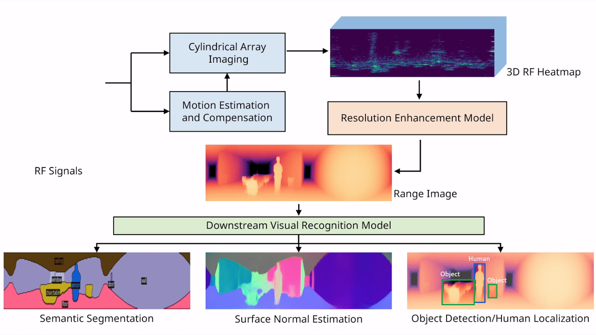
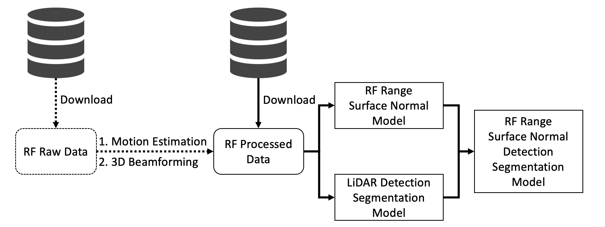
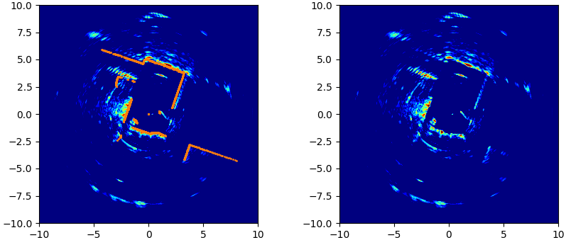

<p align="center">
  <a href="https://pytorch.org"></a>
  <a href="https://www.python.org/downloads/release/"></a>
  <a href="https://github.com/psf/black"></a>
  <a href="https://dl.acm.org/doi/10.1145/3636534.3649369"></a>
</p>

# PanoRadar [MobiCom'24]

This is an official PyTorch implementation of PanoRadar for the following paper: <br/>

> **[Enabling Visual Recognition at Radio Frequency](https://dl.acm.org/doi/10.1145/3636534.3649369)**  
> [Haowen Lai](https://haowenlai.github.io), [Gaoxiang Luo](https://gaoxiangluo.github.io/), [Yifei Liu](https://freddyliu06.github.io/), [Mingmin Zhao](https://www.cis.upenn.edu/~mingminz/)    
> *ACM International Conference on Mobile Computing and Networking (**MobiCom**), 2024* 
>

[[`Paper`](https://dl.acm.org/doi/10.1145/3636534.3649369)] [[`Website`](https://penn-waves-lab.github.io/projects/panoradar)] [[`Demo Video`](https://youtu.be/dKyQ1XuPorU?feature=shared)] [[`Dataset`](https://upenn.box.com/v/panoradar-dataset)] [[`BibTeX`](#CitingPanoRadar)]

---

## Overview

## Updates
* [Sept. 26, 2024] Initial release.

## Installation
Both Conda (recommended) and Docker environments are supported.

### Requirements
- Linux with Python ≥ 3.10
- Detectron2: follow [Detectron2 installation instructions](https://detectron2.readthedocs.io/tutorials/install.html).
- PyTorch ≥ 2.0.0 and TorchVision that matches the PyTorch installation.

### Conda environment (recommended)
```bash
conda create --name panoradar python=3.10
conda activate panoradar

pip install -r requirements.txt
pip install 'git+https://github.com/facebookresearch/detectron2.git'
```

### Docker (optional)
For Docker users, we also provide the dockerfile to build the image. You might need `sudo` access to run the commands.
```bash
# build the image
~/docker$ docker build -f docker/Dockerfile -t panoradar .  # don't omit the ending dot

# run a new container
~$ docker run -it --gpus all -v ~/PanoRadar:/mnt/PanoRadar --shm-size=4096M panoradar /bin/bash
```
## Pipeline


## Dataset
Our dataset includes two parts: the **RF Raw Data** (i.e., raw I/Q samples, inputs to the signal processing algorithms) and the **RF Processed Data** (i.e., 3D heatmaps, inputs to the machine learning models). The dataset is available [**here**](https://upenn.box.com/v/panoradar-dataset). Below is the description:

- RF Raw Data: We recorded the RF, LiDAR, and IMU data in 12 different buildings. All of them have timestamps and are synchronized. For each building, we collected the data when the robot was moving, while for the same trajectory, "static data" were also collected (the robot remained static at one location for about 5s before moving to the next one). We trim those redundant frames in static data to reduce the size of the dataset.

- RF Processed Data: This is the data for the machine learning pipeline. It contains the RF beamforming results (i.e., 3D RF Heatmaps), LiDAR range ground truth label, glass masks (i.e., binary segmentation label), semantic segmentation ground truth label, and object detection ground truth label. The RF beamforming results are from our signal processing algorithms (e.g., motion estimation and 3D beamforming). **If the users want to skip the signal processing and directly try the ML pipeline, they can directly download the RF Processed Data.**

After downloading the data, please put the RF Raw Data in `./data/raw`. Similarily, put RF processed data in `./data/processed`. If you have more free disk space somewhere else, symbolic links can be utilized.

## Signal Processing for Beamforming
The following scripts will run our signal processing scripts.

### Motion Estimation
This script will perform motion estimation for all trajectories in the specific building. For each trajectory, it will output a `motion_output.npz` file in the folder of the trajectory. `folder_name` below is the name of the name of the building folder holding the raw RF data.

```bash
python run.py motion_estimation \
  --in_building_folder {folder_name}
```

Example:

```bash
python run.py motion_estimation \
  --in_building_folder data/raw/DRL_moving
```

### Imaging (3D Beamforming) for One Frame for Visualization
This script will visualize the signal processing result for a specific frame in a trajectory. The trajectory and frame is specified with the parameters `trajectory_name` and `frame_num` below. 

```bash
python run.py imaging \
  --in_traj_folder {trajectory_name} \
  --frame_num {frame_num}
```

Example:

```bash
python run.py imaging \
  --traj_name data/raw/DRL_moving/exp20230528-000 \
  --frame_num 5
```

<p align="center">
  
</p>

An additional parameter `out_plot_folder` can also be specified to save the imaging result as a `.png` file if you are running on a headless mode (e.g., on a server without a display).

```bash
python run.py imaging \
  --in_traj_folder {trajectory_name} \
  --frame_num {frame_num}
  --out_plot_folder {path_to_save_image}
```

Example:

```bash
python run.py imaging \
  --traj_name data/raw/DRL_moving/exp20230528-000 \
  --frame_num 5
  --out_plot_folder . # To save in the root PanoRadar directory
```

### Imaging and Prepare ML data
We have also provided a script that will process the RF Raw Data to generate the machine learning inputs for all trajectories in the specific building. 

```bash
python run.py process_raw \
  --in_building_folder {folder_name} \
  --out_proc_folder {out_folder_path}
```

Example:

```bash
python run.py process_raw \
  --in_building_folder data/raw/DRL_moving \
  --out_proc_folder data/processed
```

## Training
In the following, we provide step-by-step instructions to train the model for one building.

NOTE: we currently have not tested the code for multi-GPU support. If you encounter any problems, please feel free to open an issue.

### Range and Surface Normal Training
Our model training follows a two-stage regime. In the first stage, we (pre)train the range estimation model with surface normal estimation as an auxiliary task to get LiDAR-comparable range estimation.
```bash
python train_net.py \
  --config-file configs/depth_sn.yaml \
  --num-gpus 1 \
  DATASETS.BASE_PATH "./data/processed" \
  DATASETS.TRAIN "('lobo_train_DRL',)" \
  DATASETS.TEST "('lobo_test_DRL',)" \
  OUTPUT_DIR "logs/mobicom24-lobo-DRL-unet-bs8" \
  VIS_PERIOD -1
```

Set `VIS_PERIOD` to a positive integer (e.g., `5000` iterations) if you wish to visualize the training process (e.g., log images) in tensorboard.

Then, we will train the two-stage model where the model architecture of the range-surface-normal stage is identical to the one aforementioned. To make use of the range-and-surface-normal pretrained weights and ImageNet pretrained weights for semantic segmentation and object detection that we will be downloading from the internet, we use the following script to stitch the weights.

```bash
python prepare_params.py \
  --config-file logs/mobicom24-lobo-levine-unet-bs8/config.yaml
```
This will produce a `two_stage.pth` file in the same directory as the config file. We can then use this file to initialize the weights for the two-stage training.

### (Pre)training on LiDAR Data (Optional)
Instead of using the pretrained weights from ImageNet as initialization, we can also trained the object detection and semantic segmentation stage using the LiDAR range estimation data, which is better because it's task-specific. This can be done by running the following script.
```bash
python train_net.py \
  --config-file configs/lidar.yaml \
  --num-gpus 1 \
  DATASETS.BASE_PATH "./data/processed" \
  DATASETS.TRAIN "('lobo_train_DRL',)" \
  DATASETS.TEST "('lobo_test_DRL',)" \
  OUTPUT_DIR "logs/mobicom24-lobo-DRL-lidar-bs4" 
```
And the following script will stich the weights and save as `two_stage.pth` file in the same directory as the `config-file`.
```bash
python prepare_params.py \
  --config-file logs/mobicom24-lobo-levine-unet-bs8/config.yaml \
  --lidar-config-file logs/mobicom24-lobo-levine-lidar-bs4/config.yaml
```

### Two-stage Training
The following script will jointly train the two-stage model by specifying the combined weights `MODEL.WEIGHTS`.
```bash
python train_net.py \
  --config-file configs/two_stage.yaml \
  --num-gpus 1 \
  DATASETS.BASE_PATH "./data/processed" \
  DATASETS.TRAIN "('lobo_train_DRL',)" \
  DATASETS.TEST "('lobo_test_DRL',)" \
  OUTPUT_DIR "logs/mobicom24-lobo-DRL-two-stage-bs4" \
  MODEL.WEIGHTS "logs/mobicom24-lobo-DRL-unet-bs8/two_stage.pth" \
  VIS_PERIOD -1
```
Similarily, set `VIS_PERIOD` to a positive number if you wish to visualize the training process.

## Evaluation
We can evaluate the model performance on the leave-one-building-out (lobo) test set by specifying the metrics (e.g., `depth`, `sn`, `seg`, `obj`) we want to compute. A `eval_results.txt` file will be saved in the same directory as the config file.
```bash
python eval.py \
  --metrics depth sn \
  --config-file logs/mobicom24-lobo-levine-unet-bs8/config.yaml 
```

```bash
python eval.py \
  --metrics depth sn seg obj \
  --config-file logs/mobicom24-lobo-levine-two-stage-bs4/config.yaml
```

The following table explain the metrics in the `eval_results.txt` file:
| Name    | Meaning |
| -------- | ------- |
| depth_l1_mean/median/80/90  | The mean/median/80th-percentile/90th-percentile of the range prediction errors |
| depth_psnr/ssim | The PSNR or SSIM of the predicted range images |
| sn_angle_mean/median/80/90 | The mean/median/80th-percentile/90th-percentile of the surface normal angle errors |
| IoU-xxx, mIoU | The IoU of different categories/mean IoU for semantic segmentation |
| Acc-xxx, mAcc | The accuracy of different categories/mean accuracy for semantic segmentation |
| AP/AP30/AP50/AP75-xxx | The object detection average precision (AP) at different IoU thresholds for categories |
| mAP/mAP30/mAP50/mAP75 | The object detection mean average precision (mAP) at different IoU thresholds|

Note: please refer to [this](https://cocodataset.org/#detection-eval) for more details about AP and mAP.

## Inference
This will visualize all the data points in the test set and save it under the same directory as the config file. To visualize the depth and surface normal estimation model, run the following script and an folder named `vis_XX` will be created under the same directory as the config file.
```bash
python inference.py \
  --config-file logs/mobicom24-lobo-levine-unet-bs8/config.yaml
```

To visualize the two-stage model, run the following script:
```bash
python inference.py \
  --config-file logs/mobicom24-lobo-levine-two-stage-bs4/config.yaml 
```

Or run the following script for point clouds color-coded with semantic categories:
```bash
python inference.py \
  --config-file logs/mobicom24-lobo-levine-two-stage-bs4/config.yaml --mode range
```

## ML Runtime Profiling
The following script will run the model on a subset of the test set to extract FLOPs and inference speed.
```bash
python runtime.py \
  --config-file configs/depth_sn.yaml \
  --num-gpus 1
```

```bash
python runtime.py \
  --config-file configs/two_stage.yaml \
  --num-gpus 1
```


## License
PanoRadar is licensed under a [BSD 3-Clause License](LICENSE).

## <a name="CitingPanoRadar"></a>Citing PanoRadar
If you use PanoRadar in your research, find the code useful, or would like to acknowledge our work, please consider citing our paper:

```BibTeX
@inproceedings{PanoRadar,
  author    = {Lai, Haowen and Luo, Gaoxiang and Liu, Yifei and Zhao, Mingmin},
  title     = {Enabling Visual Recognition at Radio Frequency},
  booktitle = {ACM International Conference on Mobile Computing and Networking (MobiCom)},
  year      = {2024},
  doi       = {https://doi.org/10.1145/3636534.3649369},
}
```
